### Task 0: Install a ubuntu 16.04 server 64-bit

on a virtual machine, installation done.

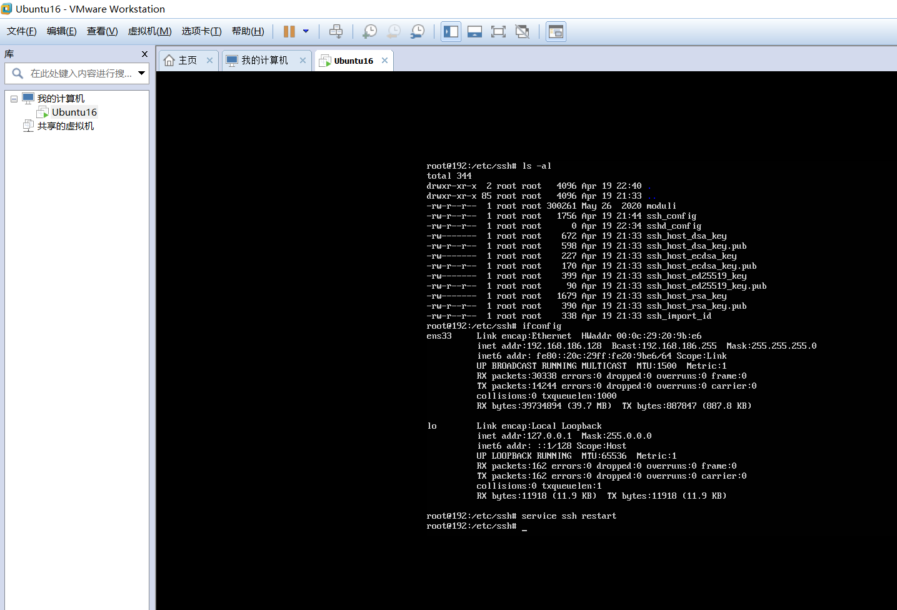

for VM, use NAT network and forward required ports to host machine --done
- 22->2222 for ssh
- 80->8080 for gitlab
- 8081/8083->8081/8083 for go app
- 31080/31081->31080/31081 for go app in k8s

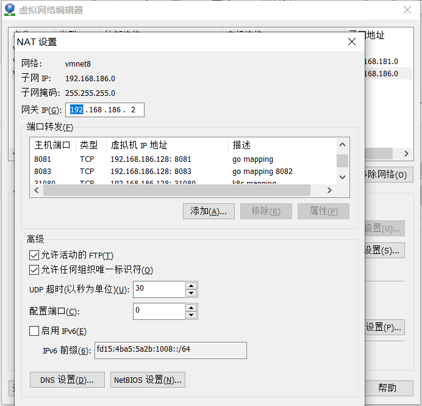


 Update  VMnet8 config, to make sure it's in the same subnet as the IP of virtual machine:Ubuntu16

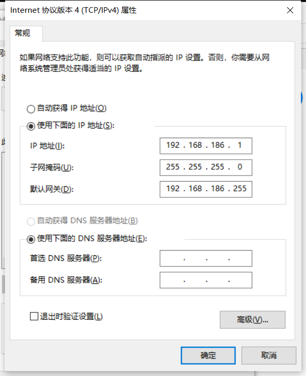


### Task 1: Update system

($ ssh user@localhost -p 2222) -- done

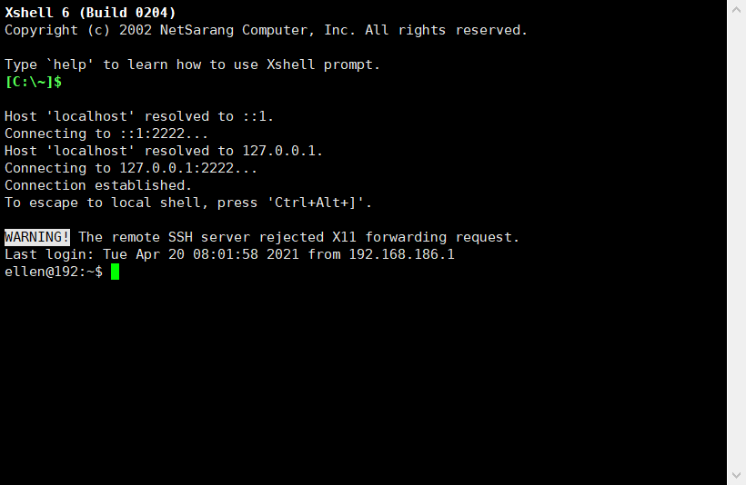

upgrade the kernel to the 16.04 latest  -- done

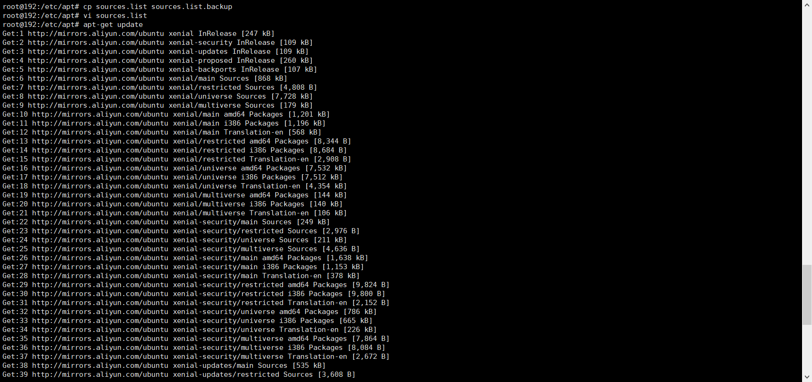


### Task 2: install gitlab-ce version in the host
Expect output: Gitlab is up and running at http://127.0.0.1 (no tls or FQDN required)
Access it from host machine http://127.0.0.1:8080  -- done
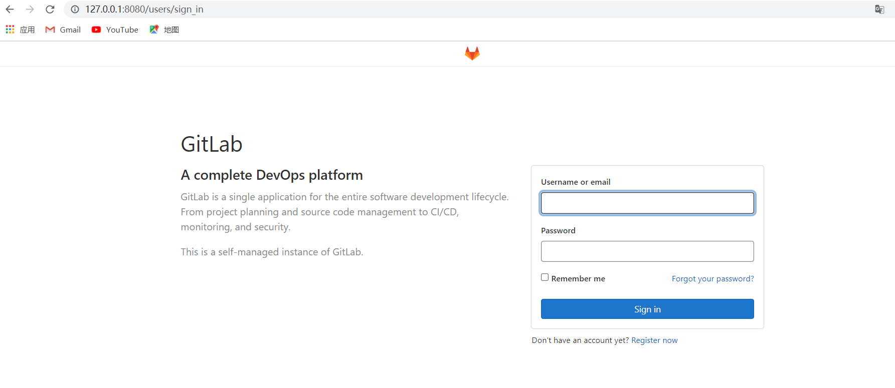

### Task 3: create a demo group/project in gitlab
Expected source code at http://127.0.0.1:8080/demo/go-web-hello-world  -- done

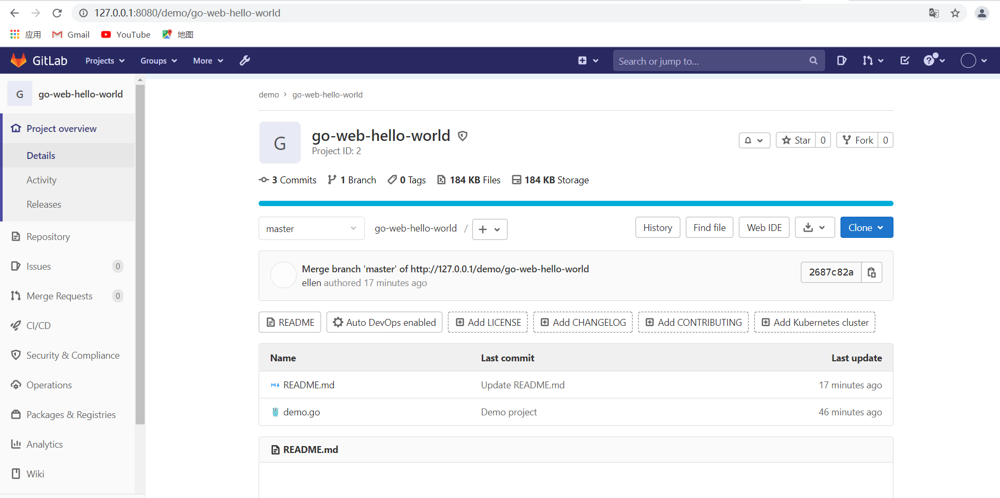

### Task 4: build the app and expose ($ go run) the service to 8081 port

Expect output:  -- done
```
curl http://127.0.0.1:8081
Go Web Hello World!
```


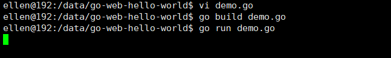

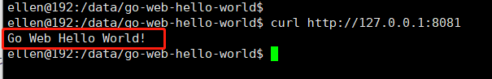

### Task 5: install docker
--done

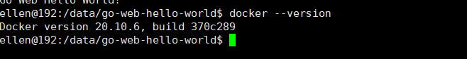


### Task 6: run the app in container

1) build a docker image ($ docker build) for the web app and run that in a container ($ docker run), expose the service to 8083 (-p)
please note 8082 was used by other app.  -- done
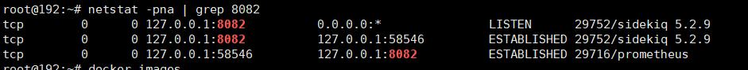
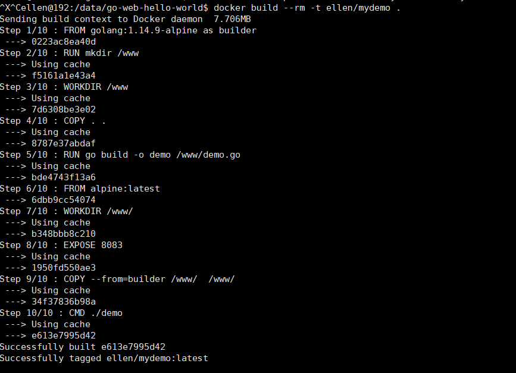
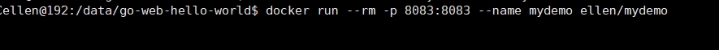


2) Expected output:  -- done
```
curl http://127.0.0.1:8083
Go Web Hello World!
```
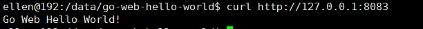
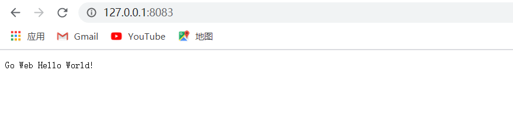

3) Check in the Dockerfile into gitlab  -- done

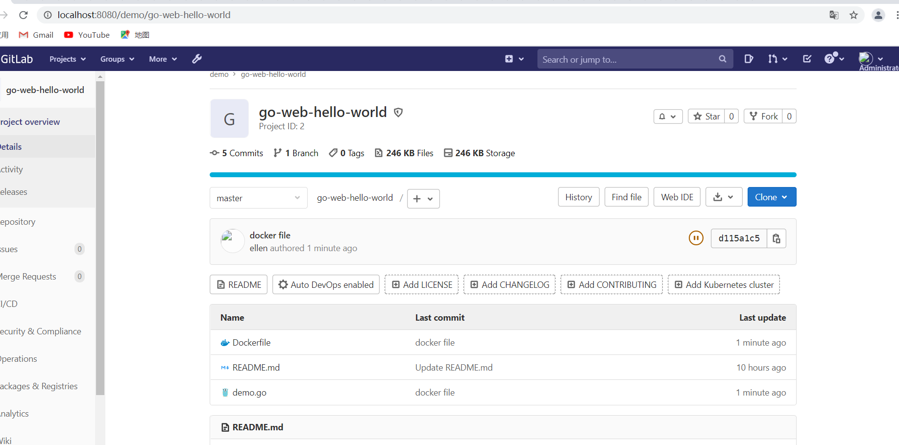


### Task 7: push image to dockerhub

tag the docker image using your_dockerhub_id/go-web-hello-world:v0.1 and push it to docker hub (https://hub.docker.com/)
-- done
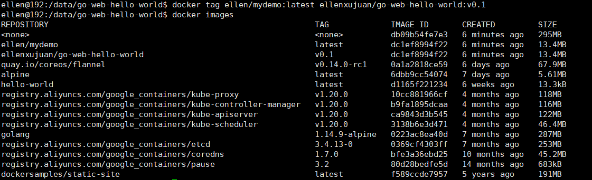
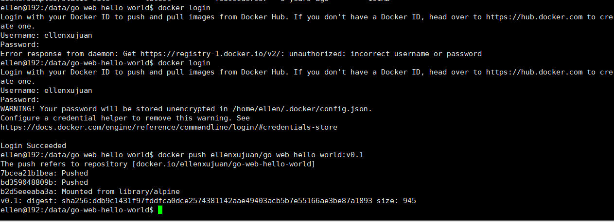


Expected output:
https://hub.docker.com/r/ellenxujuan/go-web-hello-world

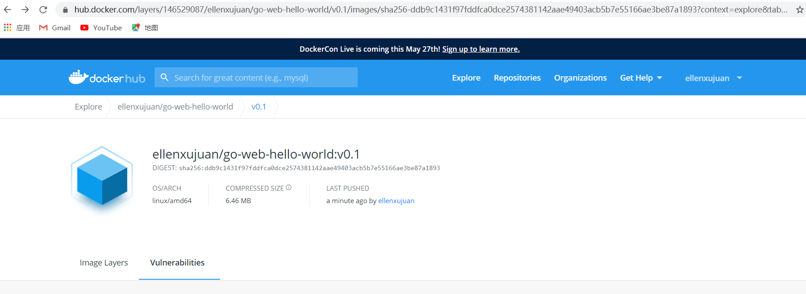


