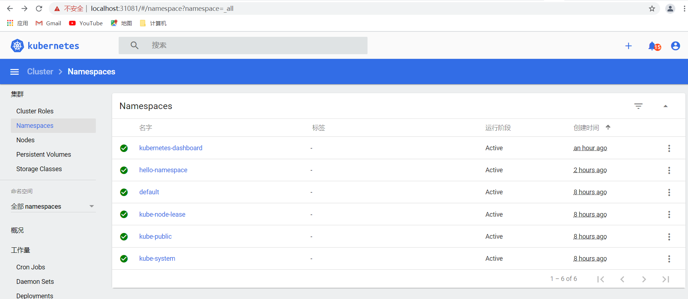

1)find out the namespace for kubernetes-dashboard 
kubectl get pods --all-namespaces

2)create serviceaccount:admin-user
root@192:/data/go-web-hello-world# vi admin-user.yaml
root@192:/data/go-web-hello-world# kubectl create -f admin-user.yaml 

3)serviceaccount bind to cluster role 
 kubectl create -f admin-user-role-binding.yaml 

4)get the token, and input to k8s dashboard login: https://localhost:31081/
root@192:/data/go-web-hello-world# kubectl get secret -n kubernetes-dashboard|grep admin
admin-user-token-p9zmg             kubernetes.io/service-account-token   3      11m

root@192:/data/go-web-hello-world# kubectl -n kubernetes-dashboard describe secret $(kubectl -n kubernetes-dashboard get secret | grep admin-user | awk '{print $1}')
Name:         admin-user-token-p9zmg
Namespace:    kubernetes-dashboard
Labels:       <none>
Annotations:  kubernetes.io/service-account.name: admin-user
              kubernetes.io/service-account.uid: 400cf739-30cc-457d-a45d-130704e6fccf

Type:  kubernetes.io/service-account-token

Data
====
ca.crt:     1066 bytes
namespace:  20 bytes
token:      eyJhbGciOiJSUzI1NiIsImtpZCI6Im9Ob2NYeXVXSEhlNmdEV25NaEJ5aDFLRUpicVY4YW01Z2Vxb1A2aFRIOUEifQ.eyJpc3MiOiJrdWJlcm5ldGVzL3NlcnZpY2VhY2NvdW50Iiwia3ViZXJuZXRlcy5pby9zZXJ2aWNlYWNjb3VudC9uYW1lc3BhY2UiOiJrdWJlcm5ldGVzLWRhc2hib2FyZCIsImt1YmVybmV0ZXMuaW8vc2VydmljZWFjY291bnQvc2VjcmV0Lm5hbWUiOiJhZG1pbi11c2VyLXRva2VuLXA5em1nIiwia3ViZXJuZXRlcy5pby9zZXJ2aWNlYWNjb3VudC9zZXJ2aWNlLWFjY291bnQubmFtZSI6ImFkbWluLXVzZXIiLCJrdWJlcm5ldGVzLmlvL3NlcnZpY2VhY2NvdW50L3NlcnZpY2UtYWNjb3VudC51aWQiOiI0MDBjZjczOS0zMGNjLTQ1N2QtYTQ1ZC0xMzA3MDRlNmZjY2YiLCJzdWIiOiJzeXN0ZW06c2VydmljZWFjY291bnQ6a3ViZXJuZXRlcy1kYXNoYm9hcmQ6YWRtaW4tdXNlciJ9.31grXhWHh2qMboTbRyCW1dKhnDth1d3dPmvGNOxMWCyx8NJyBabEss36AlzLX62FZXRNoDG-1zsDRYo_jqW_IUbUNjw5thpRH4I8uqQmeWQL8OUWUVxrW3QhadoUlfwgP8XjQXGrcAab_tRplCXlSvxKBIPst90Hke34Bkta6DhhB9YBZ7Rl0UGITF4CZeu465VpInEEFIIMlBenRA7ekoMY4dp39G87ra7GVHdmqZeTPBZ5KV2BTS0khP_zaYIwOrlI4O566el0hlERNIcINh1uCD5Zgwc-qE1Ng-1ZNDlgnqV2CDpBVGGpJb1KC0k1GwjzzlVVkK9TxtlHAxFJPQ
root@192:/data/go-web-hello-world# 

Now k8s Dashboard Displayed

